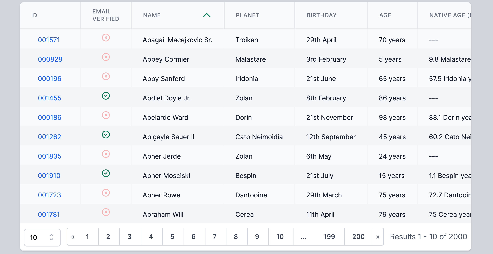

# Livewire Datatables

[](https://packagist.org/packages/mediconesystems/livewire-datatables)
[](https://packagist.org/packages/mediconesystems/livewire-datatables)

### Features
- Use a model or query builder to supply data
- Mutate and format columns using preset or custom callbacks
- Sort data using column or computed column
- Filter using booleans, times, dates, selects or free text
- Create complex combined filters using the [complex query builder](#complex-query-builder)
- Show / hide columns
- Column groups
- Mass Action (Bulk) Support

## [Live Demo App](https://livewire-datatables.com)

## [Demo App Repo](https://github.com/MedicOneSystems/demo-livewire-datatables)



## Requirements
- [Laravel 7, 8 or 9](https://laravel.com/docs/9.x)
- [Livewire](https://laravel-livewire.com/)
- [Tailwind](https://tailwindcss.com/)
- [Alpine JS](https://github.com/alpinejs/alpine)

## Installation

You can install the package via composer:

```bash
composer require mediconesystems/livewire-datatables
```
### Optional
You don't need to, but if you like you can publish the config file and blade template assets:
```bash
php artisan vendor:publish --provider="Mediconesystems\LivewireDatatables\LivewireDatatablesServiceProvider"
```
This will enable you to modify the blade views and apply your own styling, the datatables views will be published to resources/livewire/datatables. The config file contains the default time and date formats used throughout
> - This can be useful if you're using Purge CSS on your project, to make sure all the livewire-datatables classes get included

Several of the built-in dynamic components use Alpine JS, so to remove flickers on page load, make sure you have
```css
[x-cloak] {
    display: none;
}
```
somewhere in your CSS

## Basic Usage

- Use the ```livewire-datatable``` component in your blade view, and pass in a model:
```html
...

<livewire:datatable model="App\User" name="all-users" />

...
```

## Template Syntax
- There are many ways to modify the table by passing additional properties into the component:
```html
<livewire:datatable
    model="App\User"
    name="users"
    include="id, name, dob, created_at"
    dates="dob"
/>
```

*Attention*: Please note that having multiple datatables on the same page _or_ more than one datatable of the same
type on different pages needs to have a unique `name` attribute assigned to each one so they do not conflict with each
other as in the example above.

### Props
| Property | Arguments | Result | Example |
|----|----|----|----|
|**model**|*String* full model name|Define the base model for the table| ```model="App\Post"```|
|**include**|*String\|Array* of column definitions|specify columns to be shown in table, label can be specified by using \| delimter | ```include="name, email, dob\|Birth Date, role"```|
|**exclude**|*String\|Array* of column definitions|columns are excluded from table| ```:exclude="['created_at', 'updated_at']"```|
|**hide**|*String\|Array* of column definitions|columns are present, but start hidden|```hidden="email_verified_at"```|
|**dates**|*String\|Array* of column definitions [ and optional format in \| delimited string]|column values are formatted as per the default date format, or format can be included in string with \| separator | ```:dates="['dob\|lS F y', 'created_at']"```|
|**times**|*String\|Array* of column definitions [optional format in \| delimited string]|column values are formatted as per the default time format, or format can be included in string with \| separator | ```'bedtime\|g:i A'```|
|**searchable**|*String\|Array* of column names | Defines columns to be included in global search | ```searchable="name, email"```|
|**sort**|*String* of column definition [and optional 'asc' or 'desc' (default: 'desc') in \| delimited string]|Specifies the column and direction for initial table sort. Default is column 0 descending | ```sort="name\|asc"```|
|**hide-header**|*Boolean* default: *false*|The top row of the table including the column titles is removed if this is ```true```| |
|**hide-pagination**|*Boolean* default: *false*|Pagination controls are removed if this is ```true```| |
|**per-page**|*Integer* default: 10|Number of rows per page| ```per-page="20"``` |
|**exportable**|*Boolean*  default: *false*|Allows table to be exported| ```<livewire:datatable model="App/Post" exportable />``` |
|**hideable**| _String_ | gives ability to show/hide columns, accepts strings 'inline', 'buttons', or 'select'| ```<livewire:datatable model="App/Post" hideable="inline" />``` |
|**beforeTableSlot**| _String_ |blade view to be included immediately before the table in the component, which can therefore access public properties|  |
|**afterTableSlot**| _String_ |blade view to be included immediately after the table in the component, which can therefore access public properties| [demo](https://livewire-datatables.com/complex) |
---


## Component Syntax

### Create a livewire component that extends ```Mediconesystems\LivewireDatatables\LivewireDatatable```
> ```php artisan livewire:datatable foo``` --> 'app/Http/Livewire/Foo.php'

> ```php artisan livewire:datatable tables.bar``` --> 'app/Http/Livewire/Tables/Bar.php'

### Provide a datasource by declaring public property ```$model``` **OR** public method ```builder()``` that returns an instance of ```Illuminate\Database\Eloquent\Builder```
> ```php artisan livewire:datatable users-table --model=user``` --> 'app/Http/Livewire/UsersTable.php' with ```public $model = User::class```

### Declare a public method ```columns``` that returns an array containing one or more ```Mediconesystems\LivewireDatatables\Column```

## Columns
Columns can be built using any of the static methods below, and then their attributes assigned using fluent method chains.
There are additional specific types of Column; ```NumberColumn```, ```DateColumn```, ```TimeColumn```, using the correct one for your datatype will enable type-specific formatting and filtering:

| Class | Description |
|---|---|
|Column|Generic string-based column. Filter will be a text input|
|NumberColumn| Number-based column. Filters will be a numeric range|
|BooleanColumn| Values will be automatically formatted to a yes/no icon, filters will be yes/no|
|DateColumn| Values will be automatically formatted to the default date format. Filters will be a date range|
|TimeColumn| Values will be automatically formatted to the default time format. Filters will be a time range|
|LabelColumn| Fixed header string ("label") with fixed content string in every row. No SQL is executed at all|
___

```php
class ComplexDemoTable extends LivewireDatatable
{

    public function builder()
    {
        return User::query();
    }

    public function columns()
    {
        return [
            NumberColumn::name('id')
                ->label('ID')
                ->linkTo('job', 6),

            BooleanColumn::name('email_verified_at')
                ->label('Email Verified')
                ->format()
                ->filterable(),

            Column::name('name')
                ->defaultSort('asc')
                ->group('group1')
                ->searchable()
                ->hideable()
                ->filterable(),

            Column::name('planet.name')
                ->label('Planet')
                ->group('group1')
                ->searchable()
                ->hideable()
                ->filterable($this->planets),

            DateColumn::name('dob')
                ->label('DOB')
                ->group('group2')
                ->filterable()
                ->hide(),

            (new LabelColumn())
                ->label('My custom heading')
                ->content('This fixed string appears in every row'),

            NumberColumn::name('dollars_spent')
                ->enableSummary(),
        ];
    }
}
```

### Column Methods
| Method | Arguments | Result | Example |
|----|----|----|----|
|_static_ **name**| *String* $column |Builds a column from column definition, which can be eith Eloquent or SQL dot notation (see below) |```Column::name('name')```|
|_static_ **raw**| *String* $rawSqlStatement|Builds a column from raw SQL statement. Must include "... AS _alias_"|```Column::raw("CONCAT(ROUND(DATEDIFF(NOW(), users.dob) / planets.orbital_period, 1) AS `Native Age`")```|
|_static_ **callback**|*Array\|String* $columns, *Closure\|String* $callback| Passes the columns from the first argument into the callback to allow custom mutations. The callback can be a method on the table class, or inline | _(see below)_|
|_static_ **scope**|*String* $scope, *String* $alias|Builds a column from a scope on the parent model|```Column::scope('selectLastLogin', 'Last Login')```|
|_static_ **delete**|[*String* $primaryKey default: 'id']|Adds a column with a delete button, which will call ```$this->model::destroy($primaryKey)```|```Column::delete()```|
|_static_ **checkbox**|[*String* $column default: 'id']|Adds a column with a checkbox. The component public property ```$selected``` will contain an array of the named column from checked rows, |```Column::checkbox()```|
|**label**|*String* $name|Changes the display name of a column|```Column::name('id')->label('ID)```|
|**group**|*String* $group|Assign the column to a group. Allows to toggle the visibility of all columns of a group at once|```Column::name('id')->group('my-group')```|
|**format**|[*String* $format]|Formats the column value according to type. Dates/times will use the default format or the argument |```Column::name('email_verified_at')->filterable(),```|
|**hide**| |Marks column to start as hidden|```Column::name('id')->hidden()```|
|**sortBy**|*String\|Expression* $column|Changes the query by which the column is sorted|```Column::name('dob')->sortBy('DATE_FORMAT(users.dob, "%m%d%Y")'),```|
|**truncate**|[*Integer* $length (default: 16)]Truncates column to $length and provides full-text in a tooltip. Uses ```view('livewire-datatables::tooltip)```|```Column::name('biography)->truncate(30)```|
|**linkTo**|*String* $model, [*Integer* $pad]|Replaces the value with a link to ```"/$model/$value"```. Useful for ID columns. Optional zero-padding. Uses ```view('livewire-datatables::link)```|```Column::name('id')->linkTo('user')```|
|**link**|*String* $href, [*String* $slot]|Let the content of the column render as a link. You may use {{ }} syntax to fill the url with any attributes of the current row. Uses ```view('livewire-datatables::link)```|```Column::name('first_name')->link('/users/{{slug}}/edit', 'edit {{first_name}} {{last_name}}')```|
|**round**|[*Integer* $precision (default: 0)]|Rounds value to given precision|```Column::name('age')->round()```|
|**defaultSort**|[*String* $direction (default: 'desc')]|Marks the column as the default search column|```Column::name('name')->defaultSort('asc')```|
|**searchable**| |Includes the column in the global search|```Column::name('name')->searchable()```|
|**hideable**| |The user is able to toggle the visibility of this column|```Column::name('name')->hideable()```|
|**filterable**|[*Array* $options], [*String* $filterScope]|Adds a filter to the column, according to Column type. If an array of options is passed it wil be used to populate a select input. If the column is a scope column then the name of the filter scope must also be passed|```Column::name('allegiance')->filterable(['Rebellion', 'Empire'])```|
|**filterOn**|*String/Array* $statement|Allows you to specify a column name or sql statement upon which to perform the filter (must use SQL syntax, not Eloquent eg. ```'users.name'``` instead of ```'user.name'```). Useful if using a callback to modify the displayed values. Can pass a single string or array of strings which will be combined with ```OR```|```Column::callback(['name', 'allegiance'], function ($name, $allegiance) { return "$name is allied to $allegiance"; })->filterable(['Rebellion', 'Empire'])->filterOn('users.allegiance')```|
|**view**|*String* $viewName| Passes the column value, whole row of values, and any additional parameters to a view template | _(see below)_|
|**editable**| | Marks the column as editable | _(see below)_|
|**alignCenter**| | Center-aligns column header and contents |```Column::delete()->alignCenter()```|
|**alignRight**| | Right-aligns column header and contents |```Column::delete()->alignRight()```|
|**editable**| | Marks the column as editable | _(see below)_|
|**exportCallback**| Closure $callback | Reformats the result when exporting | _(see below)_ |
|**excludeFromExport**| | Excludes the column from export |```Column::name('email')->excludeFromExport()```|
|**unsortable**| | Prevents the column being sortable |```Column::name('email')->unsortable()```|
___

### Listener
The component will listen for the ```refreshLivewireDatatable``` event, which allows you to refresh the table from external components.

### Eloquent Column Names
Columns from Eloquent relations can be included using the normal eloquent dot notation, eg. ```planet.name```, Livewire Datatables will automatically add the necessary table joins to include the column. If the relationship is of a 'many' type (```HasMany```, ```BelongsToMany```, ```HasManyThrough```) then Livewire Datatables will create an aggregated subquery (which is much more efficient than a join and group. Thanks [@reinink](https://eloquent-course.reinink.ca/)). By default, the aggregate type will be ```count``` for a numeric column and ```group_concat``` for a string column, but this can be over-ridden using a colon delimeter;

```php
NumberColumn::name('students.age:sum')->label('Student Sum'),

NumberColumn::name('students.age:avg')->label('Student Avg'),

NumberColumn::name('students.age:min')->label('Student Min'),

NumberColumn::name('students.age:max')->label('Student Max'),
```

### Column Groups

When you have a very big table with a lot of columns, it is possible to create 'column groups' that allows the user to toggle the visibility of a whole group at once. Use `->group('NAME')` at any column to achieve this.
You can human readable labels and translations of your groups via the `groupLabels` property of your table:

```php
class GroupDemoTable extends LivewireDatatable
{
    public $groupLabels = [
         'group1' => 'app.translation_for_group_1'
         'group2' => 'app.translation_for_group_2'
    ];

public function columns()
{
    return [
        Column::name('planets.name')
            ->group('group1')
            ->label('Planet'),

        Column::name('planets.name')
            ->group('group2')
            ->label('Planet'),
```

### Summary row
If you need to summarize all cells of a specific column, you can use `enableSummary()`:

```php
public function columns()
{
    return [
        Column::name('dollars_spent')
            ->label('Expenses in Dollar')
            ->enableSummary(),

        Column::name('euro_spent')
            ->label('Expenses in Euro')
            ->enableSummary(),
```

### Mass (Bulk) Action

If you want to be able to act upon several records at once, you can use the `buildActions()` method in your Table:

```php
public function buildActions()
    {
        return [

            Action::value('edit')->label('Edit Selected')->group('Default Options')->callback(function ($mode, $items) {
                // $items contains an array with the primary keys of the selected items
            }),

            Action::value('update')->label('Update Selected')->group('Default Options')->callback(function ($mode, $items) {
                // $items contains an array with the primary keys of the selected items
            }),

            Action::groupBy('Export Options', function () {
                return [
                    Action::value('csv')->label('Export CSV')->export('SalesOrders.csv'),
                    Action::value('html')->label('Export HTML')->export('SalesOrders.html'),
                    Action::value('xlsx')->label('Export XLSX')->export('SalesOrders.xlsx')->styles($this->exportStyles)->widths($this->exportWidths)
                ];
            }),
        ];
    }
```

### Mass Action Style

If you only have small style adjustments to the Bulk Action Dropdown you can adjust some settings here:

```php
public function getExportStylesProperty()
    {
        return [
            '1'  => ['font' => ['bold' => true]],
            'B2' => ['font' => ['italic' => true]],
            'C'  => ['font' => ['size' => 16]],
        ];
    }

    public function getExportWidthsProperty()
    {
        return [
            'A' => 55,
            'B' => 45,
        ];
    }
```

### Custom column names
It is still possible to take full control over your table, you can define a ```builder``` method using whatever query you like, using your own joins, groups whatever, and then name your columns using your normal SQL syntax:

```php

public function builder()
{
    return User::query()
        ->leftJoin('planets', 'planets.id', 'users.planet_id')
        ->leftJoin('moons', 'moons.id', 'planets.moon_id')
        ->groupBy('users.id');
}

public function columns()
{
    return [
        NumberColumn::name('id')
            ->filterable(),

        Column::name('planets.name')
            ->label('Planet'),

        Column::raw('GROUP_CONCAT(planets.name SEPARATOR " | ") AS `Moon`'),

        ...
}

```


### Callbacks
Callbacks give you the freedom to perform any mutations you like on the data before displaying in the table.
- The callbacks are performed on the paginated results of the database query, so shouldn't use a ton of memory
- Callbacks will receive the chosen columns as their arguments.
- Callbacks can be defined inline as below, or as public methods on the Datatable class, referenced by passing the name as a string as the second argument to the callback method.
- If you want to format the result differently for export, use ```->exportCallback(Closure $callback)```.
```php
class CallbackDemoTable extends LivewireDatatable
{
    public model = User::class

    public function columns()
    {
        return [
            Column::name('users.id'),

            Column::name('users.dob')->format(),

            Column::callback(['dob', 'signup_date'], function ($dob, $signupDate) {
                $age = $signupDate->diffInYears($dob);
                return $age > 18
                    ? '<span class="text-red-500">' . $age . '</span>'
                    : $age;
            })->exportCallback(function ($dob, $signupDate), {
                return $age = $signupDate->diffInYears($dob);
            }),

            ...
    }
}
```

### Views
You can specify that a column's output is piped directly into a separate blade view template.
- Template is specified using ususal laravel view helper syntax
- Views will receive the column's value as ```$value```, and the whole query row as ```$row```
```php
class CallbackDemoTable extends LivewireDatatable
{
    public model = User::class

    public function columns()
    {
        return [
            Column::name('users.id'),

            Column::name('users.dob')->view('tables.dateview'),

            Column::name('users.signup_date')->format(),
        ];
    }
```
```html
'tables/dateview.blade.php'
<span class="mx-4 my-2 bg-pink-500">
    <x-date-thing :value="$value" />
</span>
```

### Editable Columns
You can mark a column as editable using ```editable```
This uses the ```view()``` method above to pass the data into an Alpine/Livewire compnent that can directly update the underlying database data. Requires the column to have ```column``` defined using standard Laravel naming. This is included as an example. Much more comprehensive custom editable columns with validation etc can be built using the callback or view methods above.

```php
class EditableTable extends LivewireDatatable
{

    public $model = User::class;

    public function columns()
    {
        return [
            Column::name('id')
                ->label('ID')
                ->linkTo('job', 6),

            Column::name('email')
                ->editable(),

            ...
        ];
    }
}
```

# Complex Query Builder
Just add ```$complex = true``` to your Datatable Class and all filterable columns will be available in the complex query builder.

**Features**
- Combine rules and groups of rules using AND/OR logic
- Drag and drop rules around the interface


---
**Persisting Queries** (Requires AlpineJS v3 with $perist plugin)
- Add ```$persistComplexQuery = true``` to your class and queries will be stored in browser localstorage.
- By default the localstorage key will be the class name. You can provide your own by setting the public property ```$persistKey``` or overriding ```getPersistKeyProperty()``` on the Datatable Class
- eg: for user-specific persistence:

```php
public function getPersistKeyProperty()
{
    return Auth::id() . '-' . parent::getPersistKeyProperty();
}
```
---
**Saving Queries**

If you want to save permanently save queries you must provide 3 methods for adding, deleting and retrieving your saved queries using whatever logic you like:

- ```public function saveQuery(String $name, Array $rules)```
- ```public function deleteQuery(Int $id)```
- ```public function getSavedQueries()```

* In your save and delete methods, be sure to emit an ```updateSavedQueries``` livewire event and pass a fresh array of results (see example below)

### Example:
This example shows saving queries using a conventional Laravel ComplexQuery model, that belongsTo a User

```php
/* Migration */

class CreateComplexQueriesTable extends Migration
{
    public function up()
    {
        Schema::create('complex_queries', function (Blueprint $table) {
            $table->id();
            $table->unsignedInteger('user_id');
            $table->string('table');
            $table->json('rules');
            $table->string('name');
            $table->timestamps();
        });
    }
}


/* Model */

class ComplexQuery extends BaseModel
{
    protected $casts = ['rules' => 'array'];

    public function user()
    {
        return $this->belongsTo(User::class);
    }
}

/* Datatable Class */

class TableWithSaving extends Livewire Datatable
{
    ...

    public function saveQuery($name, $rules)
    {
        Auth::user()->complex_queries()->create([
            'table' => $this->name,
            'name' => $name,
            'rules' => $rules
        ]);

        $this->emit('updateSavedQueries', $this->getSavedQueries());
    }

    public function deleteQuery($id)
    {
        ComplexQuery::destroy($id);

        $this->emit('updateSavedQueries', $this->getSavedQueries());
    }

    public function getSavedQueries()
    {
        return Auth::user()->complex_queries()->where('table', $this->name)->get();
    }

    ...
}
```


# Styling
I know it's not cool to provide a package with tons of opionated markup and styling. Most other packages seem to have gone down the route of passing optional classes around as arguments or config variables. My take is that because this is just blade with tailwind, you can publish the templates and do whatever you like to them - it should be obvious where the Livewire and Alpine moving parts are.

There are methods for applying styles to rows and cells. ```rowClasses``` receives the ```$row``` and the [laravel loop variable](https://laravel.com/docs/8.x/blade#the-loop-variable) as parameters. ```cellClasses``` receives the ```$row``` and ```$column```

For example:
```php
public function rowClasses($row, $loop)
{
    return 'divide-x divide-gray-100 text-sm text-gray-900 ' . ($this->rowIsSelected($row) ? 'bg-yellow-100' : ($row->{'car.model'} === 'Ferrari' ? 'bg-red-500' : ($loop->even ? 'bg-gray-100' : 'bg-gray-50')));
}

public function cellClasses($row, $column)
{
    return 'text-sm ' . ($this->rowIsSelected($row) ? ' text-gray-900' : ($row->{'car.model'} === 'Ferrari' ? ' text-white' : ' text-gray-900'));
}
```

You can change the default CSS classes applied by the ```rowClasses``` and the ```cellClasses``` methods by changing ```default_classes``` in the ```livewire-datatables.php``` config file.

You could also override the render method in your table's class to provide different templates for different tables.


## Credits and Influences
- [Laravel](https://laravel.com/)
- [Laravel Livewire](https://laravel-livewire.com/docs/quickstart/)
- [Tailwind CSS](https://tailwindcss.com/)
- [AlpineJS](https://github.com/alpinejs/alpine)
- [livewire-tables by coryrose1](https://github.com/coryrose1/livewire-tables)
- [laravel-livewire-datatables by kdion4891](https://github.com/kdion4891/laravel-livewire-tables)
- [Jonathan Reinink\'s Eloquent course](https://eloquent-course.reinink.ca/)
